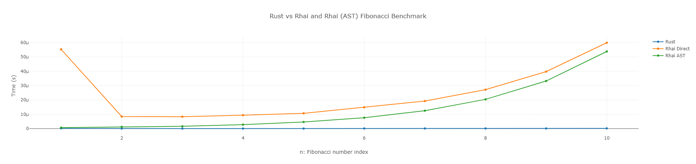

# Benchmark Rust Rhai

very simple benchmarking, Rust vs Rhai script (Direct) and Rhai (AST) that culculates the 1 to 10th Fibonacci number.

## How to run

just hit the following command in the terminal.

```bash
cargo run --release
```

or, you can run in the docker container automatically.

```bash
docker-compose up
```

then you will see the result of the benchmarking as `benchmark_results.html` in the root directory like below.


